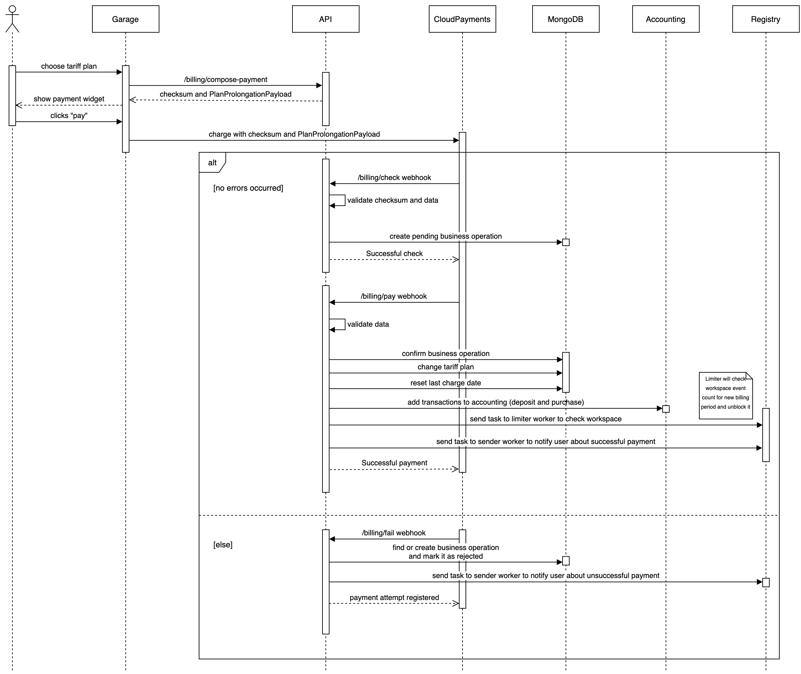

# Hawk billing

## Definition

Billing is the process of requesting and carrying out a payment from a client for the services provided.

## Tariff plans

There are several tariff plans for users to choose from. 
They differ by events volume — the maximum number of events per a month.

## Payment schemes

### Single payment

The user pays for a one-time tariff plan.
After the expiration of the tariff plan, the workspace is blocked and the reception of events stops,
but user can pay for the tariff plan again.

### Recurrent payment

The user subscribes to a tariff plan and every month he is automatically charged for it.
The user can cancel the subscription at any time. 
In this case, the tariff plan will be active until the end of the payment period.

## Scheme of processing single payment

## Scheme of processing recurrent payment
Work in progress
